  <a href="https://github.com/RusdiEneri">
    
    <!--  -->
  </a>

 

## 👨‍💻 Tentang Saya

> 🇬🇧 *Prefer English? [Read the English version](./README.md)*

Saya adalah seorang **Backend & Network Engineer** yang berbasis di **Tuban, Indonesia**, dengan fokus menjembatani pengembangan aplikasi tingkat tinggi dan operasional jaringan tingkat rendah. Saya berspesialisasi dalam membangun aplikasi web yang tangguh, merancang sistem backend yang *scalable*, dan mengamankan infrastruktur Linux.

Saya memiliki *passion* dalam merancang solusi praktis untuk memecahkan masalah dunia nyata. Keahlian saya mencakup seluruh *stack*—mulai dari merancang RESTful API dan mengelola database, hingga mengonfigurasi *firewall*, menganalisis paket jaringan, dan melakukan otomatisasi infrastruktur.

**🎯 Kompetensi Utama:**
*   **Backend Engineering:** Mengembangkan API yang *scalable*, *microservices*, dan logika bisnis yang kompleks.
*   **Network & Security:** Konfigurasi *firewall*, *DNS filtering*, analisis paket, dan *secure routing*.
*   **Infrastructure & DevOps:** Administrasi sistem Linux, kontainerisasi (Docker), dan pembuatan skrip otomatisasi.
*   **Full-Stack Delivery:** Mengintegrasikan pengalaman *frontend* yang responsif dengan arsitektur *backend* yang *powerful*.

Saat ini, saya sedang memperdalam keahlian di bidang **Keamanan Jaringan, Otomatisasi Infrastruktur, dan Deployment Cloud/On-Premise** melalui proyek-proyek nyata dan eksperimen *self-hosted*.

 

## 🛠️ Teknologi & Alat

**💻 Backend & Framework**

**🎨 Frontend & Mobile**

**⚙️ Infrastruktur, DevOps & Jaringan**

 

## 🚀 Proyek Unggulan

*Tidak hanya sekadar menulis kode, saya membangun sistem yang memberikan dampak nyata.*

#### 🧠 [MahasigMind](https://github.com/RusdiEneri/MahasigMind) | *Platform Kesehatan Mental & Wellness*
> Aplikasi web komprehensif untuk melacak kondisi emosional, jurnal reflektif, dan pemesanan konsultasi psikolog yang terintegrasi.
*   **Tech:** `Laravel 11`, `React 19`, `TypeScript`, `Inertia.js`, `Tailwind CSS`
*   **Impact:** Menghadirkan pengalaman *full-stack SPA* yang sangat responsif, memastikan penanganan data kesehatan pengguna yang aman, serta pembaruan UI *real-time* yang stabil.

#### 🛒 [Cuanin](https://github.com/RusdiEneri/Cuanin) | *Marketplace E-Commerce Preloved*
> *Marketplace multi-vendor* yang dinamis dengan kontrol akses berbasis peran, *wishlist*, dan integrasi negosiasi harga via WhatsApp.
*   **Tech:** `Laravel 12`, `Tailwind CSS`, `Vite`, `MySQL`
*   **Impact:** Merancang skema database yang *scalable* untuk menangani alur *cart/checkout* yang kompleks, serta mengintegrasikan API pihak ketiga untuk komunikasi penjual-pembeli yang lancar.

#### 🚚 [J&T Express Scheduling](https://github.com/RusdiEneri/jt-express-scheduling) | *Optimasi Shift Algoritmik*
> Mesin penjadwalan shift karyawan otomatis menggunakan **Algoritma Genetika** untuk menyelesaikan kendala logistik yang kompleks.
*   **Tech:** `Python`, `Streamlit`, `Pandas`, `OpenPyXL`
*   **Impact:** Memangkas waktu penjadwalan manual secara signifikan dengan memproses dataset besar dan menghasilkan matriks shift optimal berdasarkan aturan operasional kustom.

#### 🏢 [UD. Alam Makmur Jaya](https://github.com/RusdiEneri/alam-makmur-jaya) | *Sistem Informasi Bisnis*
> Sistem ERP berbasis web yang terpusat untuk mengelola transaksi penjualan harian, inventaris, penggajian karyawan, dan pelaporan keuangan.
*   **Tech:** `Express.js`, `Vite`, `Vanilla JS`, `REST API`
*   **Impact:** Mendigitalisasi operasional bisnis tradisional, memberikan pemangku kepentingan analitik *real-time* dan pelaporan PDF yang terotomatisasi.

 

## 📊 Statistik GitHub

  <table border="0">
    <tr>
      <td width="100%" align="center">
  
  </td>
  </tr>
  </table>

  <table border="0">
    <tr>
      <td width="50%" align="center">
        
      </td>
      <td width="50%" align="center">
        
      </td>
    </tr>
  </table>

  

 

## 🤝 Mari Terhubung!

Saya saat ini **terbuka untuk peluang karir baru, proyek freelance, dan kolaborasi teknologi**. Jangan ragu untuk menghubungi saya jika ingin berdiskusi tentang arsitektur backend, keamanan jaringan, atau sekadar menyapa!

  
  
  
  

 

  

