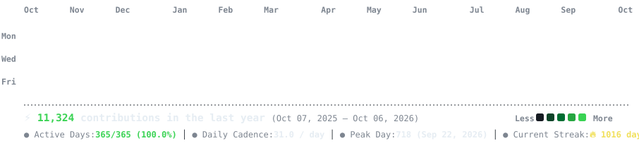
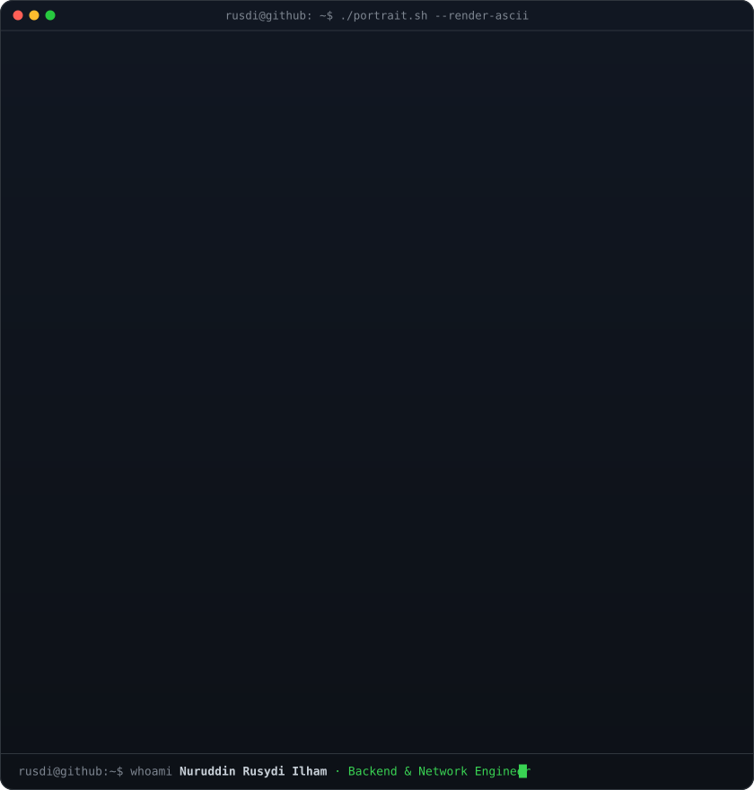
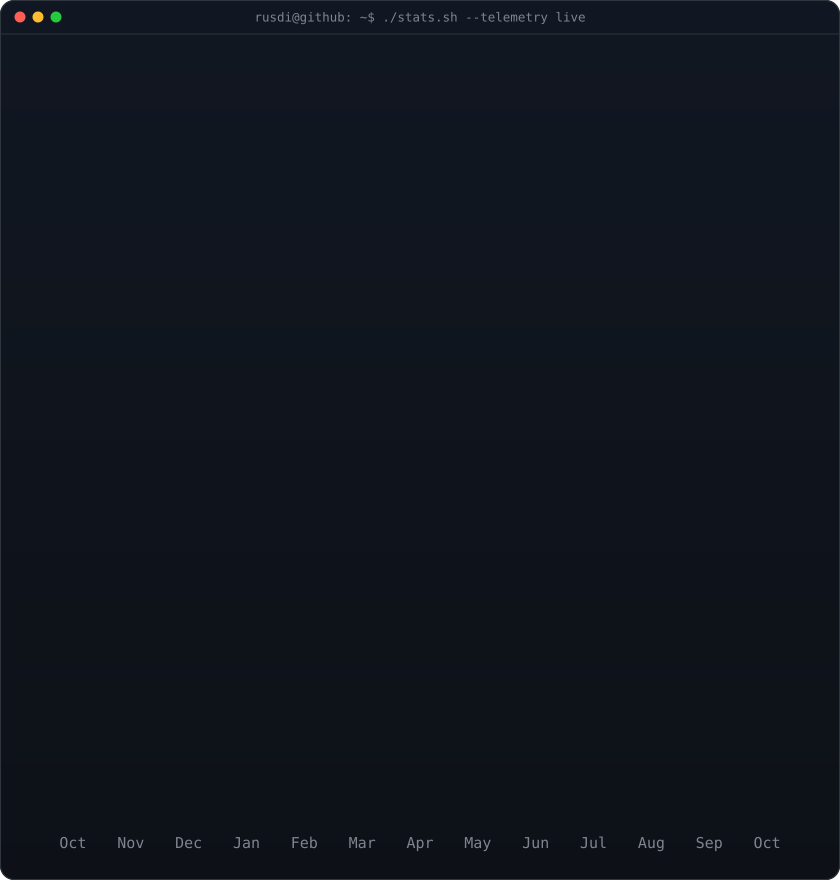
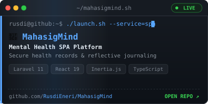
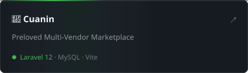
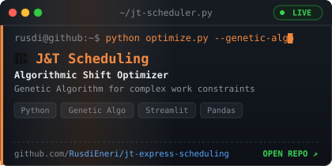
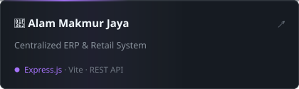

<!-- animated contribution graph: real data, boxes reveal cell by cell -->
<h3><code>rusdi@github ~ $ ./contributions.sh</code></h3>

 
 

<!-- ascii portrait (left) + streak/numbers card (right). both svgs are 840x880 -->
<h3><code>rusdi@github ~ $ whoami</code></h3>

<table>
  <tr>
    <td valign="top" width="50%"></td>
    <td valign="top" width="50%"></td>
  </tr>
</table>

 
 

<!-- featured projects: kartu terminal individual interaktif dengan animasi mengalir -->
<h3><code>rusdi@github ~ $ ./featured.sh</code></h3>

<table>
  <tr>
    <td valign="top" width="50%">
      
    </td>
    <td valign="top" width="50%">
      
    </td>
  </tr>
  <tr>
    <td valign="top" width="50%">
      
    </td>
    <td valign="top" width="50%">
      
    </td>
  </tr>
</table>

 

<!-- connect & links dengan fast-track HR recruiter -->
<h3><code>rusdi@github ~ $ ./links.sh</code></h3>

  <b>Spesialis Backend &amp; Jaringan · Infrastruktur Linux · Tuban, Indonesia 🇮🇩</b> 
  <i>🟢 Terbuka untuk Peluang Kerja Penuh Waktu (Full-Time), Remote &amp; Kontrak Proyek</i>

 
 

🇬🇧 <a href="./README.md">English Version</a>

