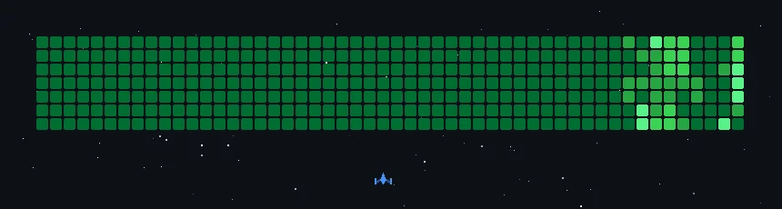

<!-- animated contribution graph: real data, boxes reveal cell by cell -->
<h3><code>rusdi@github ~ $ ./contributions.sh</code></h3>

 
 

<!-- system profile (left) + streak/numbers card (right). both svgs are 840x880 -->
<h3><code>rusdi@github ~ $ whoami</code></h3>

<table>
  <tr>
    <td valign="top" width="50%"></td>
    <td valign="top" width="50%"></td>
  </tr>
</table>

 
 

<!-- space shooter arcade simulator -->
<h3><code>rusdi@github ~ $ ./arcade.sh</code></h3>

 
 

<!-- featured projects -->
<h3><code>rusdi@github ~ $ ./featured.sh</code></h3>

  🧠 <a href="https://github.com/RusdiEneri/MahasigMind"><b>MahasigMind</b></a> · Platform Kesehatan Mental SPA <i>(Laravel 11, React 19, Inertia.js)</i> 
  🛒 <a href="https://github.com/RusdiEneri/Cuanin"><b>Cuanin</b></a> · Marketplace Multi-Vendor Preloved <i>(Laravel 12, MySQL, Vite)</i> 
  🚚 <a href="https://github.com/RusdiEneri/jt-express-scheduling"><b>J&amp;T Scheduling</b></a> · Optimasi Shift Algoritma Genetika <i>(Python, Heuristics)</i> 
  🏢 <a href="https://github.com/RusdiEneri/alam-makmur-jaya"><b>Alam Makmur Jaya</b></a> · Sistem ERP &amp; Manajemen Retail <i>(Express.js, Vite, REST)</i>

 

<!-- connect & links -->
<h3><code>rusdi@github ~ $ ./links.sh</code></h3>

<b>Spesialis Backend &amp; Jaringan · Infrastruktur Linux · Tuban, Indonesia 🇮🇩</b>

 
 

🇬🇧 <a href="./README.md">English Version</a>

